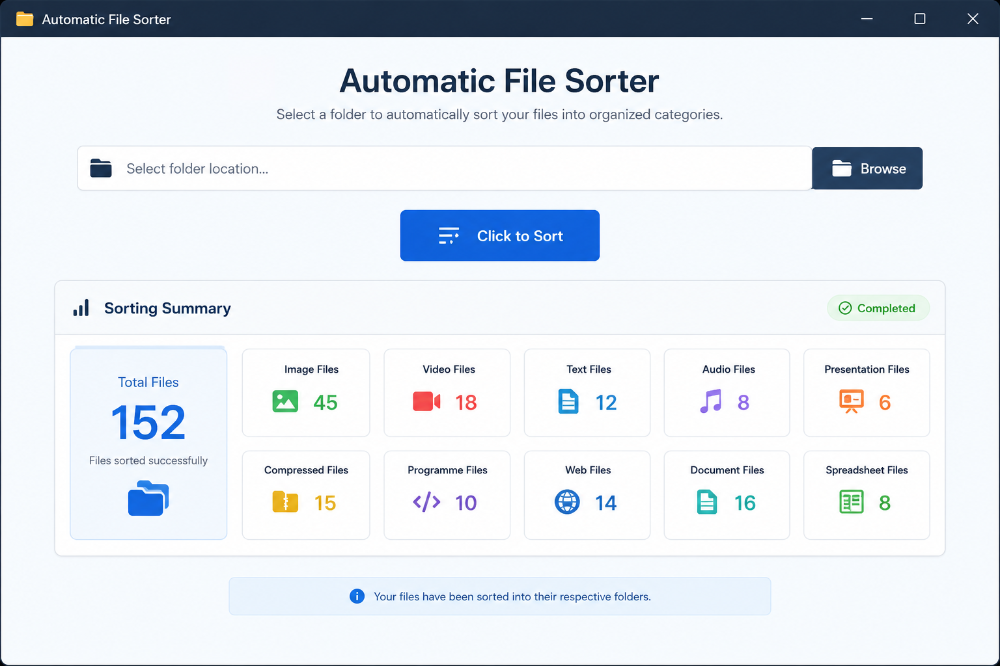

# 📂 Automatic File Sorter

A modern desktop application built with **Python** and **Tkinter** that automatically organizes files into categorized folders with a single click.


---

## 📸 Screenshot




---

# ✨ Features

- 📁 Browse and select any folder
- ⚡ One-click automatic file sorting
- 🖥️ Clean and modern Tkinter GUI
- 📊 Displays a sorting summary
- 📂 Automatically creates folders
- 🖼️ Organizes Image files
- 🎬 Organizes Video files
- 🎵 Organizes Audio files
- 📄 Organizes Text files
- 📑 Organizes Document files
- 📊 Organizes Spreadsheet files
- 🖥️ Organizes Presentation files
- 🗜️ Organizes Compressed files
- 💻 Organizes Programming files
- 🌐 Organizes Web files
- ❌ Handles invalid folder paths gracefully

---

# 📁 Project Structure

```text
Automatic-File-Sorter/
│
├── .github/
│   └── workflows/
│       └── build.yml
│
├── assets/
│   └── icons/
│       ├── icon.ico
│       ├── icon.icns
│       ├── github.png
│       ├── linkedin.png
│       ├── gmail.png
│       └── app_icon.png
│
├── main.py
├── index.py
├── README.md


```

---

# 🛠 Technologies Used

- Python 3
- Tkinter
- pathlib
- shutil
- os

---

# 🚀 Installation

Clone the repository.

```bash
git clone https://github.com/aayushpndy/Automatic-File-Sorter.git
```

Go into the project folder.

```bash
cd Automatic-File-Sorter
```

Run the application.

```bash
python main.py
```

---

# 📖 How to Use

1. Launch the application.
2. Click **Browse**.
3. Select the folder you want to organize.
4. Click **Click to Sort**.
5. The application will:
   - Scan all files
   - Create category folders
   - Move files into their respective folders
6. View the sorting summary.

---

# 📂 Supported Categories

| Category | Extensions |
|----------|------------|
| 🖼 Images | `.png`, `.jpg`, `.jpeg`, `.gif`, `.bmp`, `.webp`, `.svg`, `.heic` |
| 🎬 Videos | `.mp4`, `.mkv`, `.avi`, `.mov`, `.wmv`, `.webm`, `.3gp` |
| 🎵 Audio | `.mp3`, `.wav`, `.aac`, `.ogg`, `.flac`, `.m4a` |
| 📄 Text | `.txt` |
| 📑 Documents | `.pdf`, `.doc`, `.docx`, `.rtf` |
| 📊 Spreadsheet | `.xls`, `.xlsx`, `.csv`, `.tsv` |
| 🖥 Presentation | `.ppt`, `.pptx`, `.odp` |
| 🗜 Compressed | `.zip`, `.rar`, `.7z`, `.tar`, `.gz` |
| 💻 Programming | `.py`, `.java`, `.cpp`, `.c`, `.php`, `.js`, `.ts`, `.json` |
| 🌐 Web | `.html`, `.css`, `.js`, `.jsx`, `.tsx`, `.php` |

---

# ⚙️ Application Workflow

```text
User selects folder
        │
        ▼
Application scans files
        │
        ▼
Identify file extension
        │
        ▼
Create category folders
        │
        ▼
Move files
        │
        ▼
Display sorting summary
```

---

# 🧠 Project Architecture

## `main.py`

Responsible for:

- GUI
- Folder selection
- User interaction
- Displaying results

## `index.py`

Responsible for:

- File detection
- Folder creation
- File sorting
- Error handling
- Returning summary data

This separation makes the project easier to maintain and extend.

---

# ❗ Error Handling

The application checks for:

- Empty folder path
- Invalid folder path
- Non-existent folders

Instead of crashing, informative error messages are displayed to the user.

---

# 🔮 Future Improvements

- 🌙 Dark Mode
- 📈 Progress Bar
- 🖱 Drag & Drop Folder Support
- ↩ Undo Last Sort
- ⚙ Custom Categories
- 💾 Save User Preferences
- 📋 Activity Log
- 🔍 Duplicate File Detection

---

# 🤝 Contributing

Contributions are welcome!

1. Fork the repository
2. Create a new branch
3. Commit your changes
4. Open a Pull Request

---

# 📜 License

This project is licensed under the **MIT License**.

---

# 👨‍💻 Author

**Aayush Pandey**

Python Developer | GUI Enthusiast | BIM STUDENT 

If you found this project useful, consider giving it a ⭐ on GitHub!
